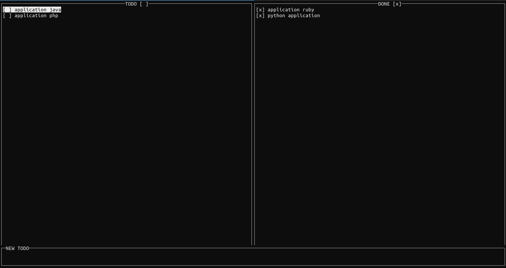

# TODO Terminal app ruby



# Quick start
* install ruby
```
apt install ruby ruby-devel

```
* install ncurses lib

```
sudo apt install libncurses5-dev
gem install curses

```
|Keys|Description|
|---|---|
|<Kbd>&#8593;</Kbd>,<kbd>&#8595;</kbd>|Move up and dow|
|<kbd>q</kbd>|Quit|
|<kbd>TAB</kbd>|Switch between the todos and dones|
|<kbd>Enter</kbd>|Perform an action on the UI|
|<kbd>n</kbd>|Insert Mode|
|<kbd>Enter</kbd>|In Insert Mode press enter To persist the new todo and quit insert mode|
|<kbd>d</kbd>|To delete todo|
|<kbd>s</kbd>|To save file |


## to run the program 

### 1 create empty file todo.txt
### 2 ruby app.rb todo.txt

